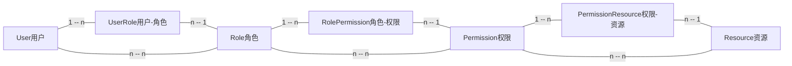
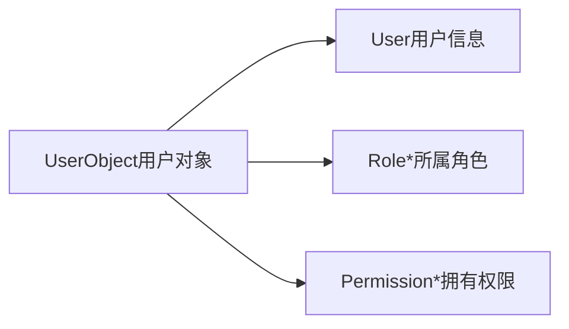
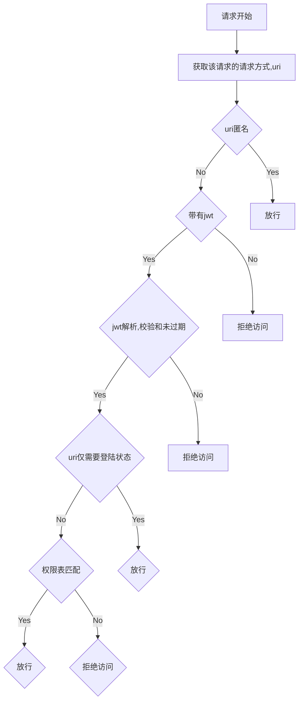
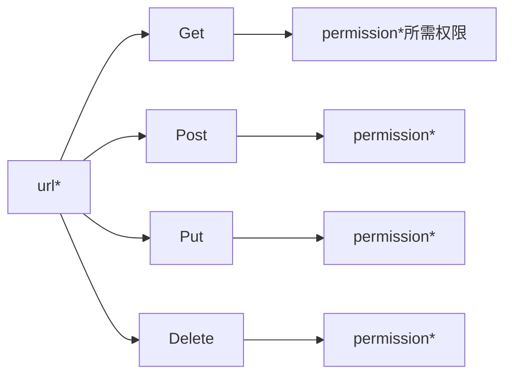
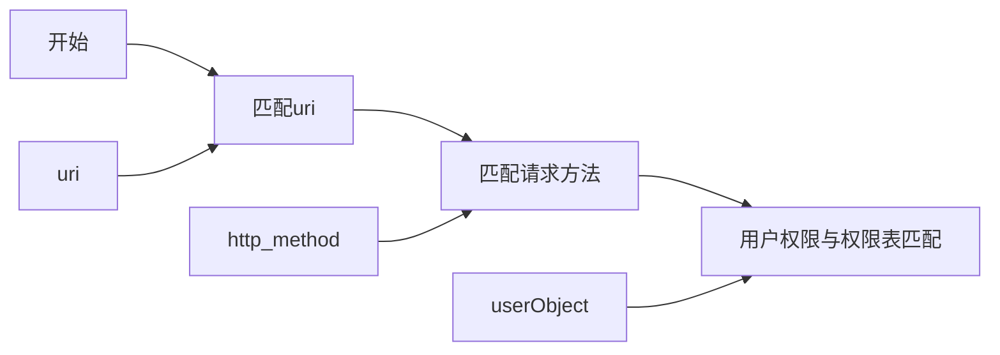
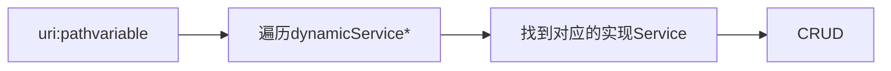

# Scala + Play 的 WebProjectKit 简单脚手架

(下面的README.md中使用mermiad语法，如果GitHub、GitLab显示不了图表那就down下来用Typora看:())

## 简单介绍

这是一个由Scala语言和Play框架开发的脚手架项目，目前仅包含有简单的、自定义的权限控制（具体控制到Restful API），自动的、slick通用的数据库查询参数模块，和自动的Crud路由的模块。目的在于简化后台类前后端分离项目、单表重复性功能项目的构建。

使用Scala和Play没有什么别的意义，只是个人喜好，通用的概念和思路都一样，使用Java+Spring(spring-boot)、Golang+Gin也是类似的思路。

### 模块

* common 通用模块、工具包类模块
* role-control 鉴权模块，权限控制
* dynamic-parameter 动态数据库查询参数模块
* dynamic-crud 动态增删改查功能模块

### 项目目录树

```
projectkit
	|- app 项目源码
	    |- controllers 控制层
	    |- modules 依赖注入模块层
	    |- service 业务层
	    |- views 渲染层
	    |- Filters.scala 过滤器、拦截器
	|- conf 项目配置
	    |- application.conf 项目配置信息
	    |- logback.xml 日志配置信息
	    |- messages I18N国际化Message配置
	    |- routes 路由配置
	|- modules 模块目录
	    |- common 通用模块
	    |- role-control 权限控制模块
	    |- dynamic-parameter 动态查询参数模块
	    |- dynamic-crud 动态Crud模块
	|- project sbt项目信息
	|- build.sbt sbt项目构建信息
```

### 外部依赖

目前这个项目所使用的（或是说验证测试）的依赖：

* Play框架自带的，需要的依赖注入

  ```scala
  guice,
    "com.google.inject.extensions" % "guice-multibindings" % "4.2.2", //guice多重注入
    "org.reflections" % "reflections" % "0.9.11",                     //反射器，自动扫描
  ```

* 数据库、Slick依赖

  ```scala
  "org.postgresql" % "postgresql" % "42.2.5",
  "com.typesafe.slick" %% "slick" % "3.3.0",
  "org.slf4j" % "slf4j-nop" % "1.6.4",
  "com.typesafe.slick" %% "slick-hikaricp" % "3.3.0",
  "com.typesafe.play" %% "play-slick" % "4.0.0",
  "com.typesafe.play" %% "play-slick-evolutions" % "4.0.0",
  ```

* Scala黑魔法scalaz依赖

  ```scala
  "org.scalaz" %% "scalaz-core" % "7.2.30",
  ```

* JWT

  ```scala
  "com.jason-goodwin" %% "authentikat-jwt" % "0.4.5",
  ```


## 模块描述

### common 通用模块

目前这个模块是没有任何代码的，作为实际项目是肯能会放上各种工具包。

---


### role-control 权限控制模块

权限控制分几部分：

* 权限控制逻辑模型
* 用户权限验证、控制过滤
* 权限描述的权限表

#### 权限控制逻辑模型

这里是使用数据库类似的模型结构来描述用户、权限之间的关系，如下图：



`用户`与`角色`通过`用户-角色`建立多对多关系，即角色可以从属多个角色，角色拥有多个用户。

`角色`与`权限`通过`角色-权限`建立多对多关系，即角色可拥有多个权限，权限可以被多个角色同时拥有。

`资源`与`权限`通过`权限-资源`建立多对多关系，即权限可以控制多个资源，资源也可以由多个权限同时控制。

根据上述描述，资源分为两种，一种是`API`资源，也就是接口的`请求-响应`，一种是前端用于渲染的按钮或是页面。

#### 用户权限验证、控制过滤

根据上面的结构，在用户为中心上构造一个用户对象结构，涵盖了用户由权限控制所需的所有信息：



然后，需要将这个用户信息与JWT签发信息序列化成JWT，每一次客户端的访问均需要将这个JWT带上一同请求，然后根据权限表匹配作出权限控制：



#### 权限描述的权限表

在项目启动时，需要先根据逻辑模型构造一个存在于内存中的权限表结构（可以是放redis、可以是放缓存、可以是服务端常驻内存）。其结构大致如下（本项目使用了HashMap来实现）：



权限表匹配用户权限逻辑大致如下：



#### Undo

暂时这个模块还没有实现一个登陆功能，这块应该与实际功能需求相关。

---


### dynamic-parameter 动态查询参数模块

对于数据库的单表查询（一般对于后台管理系统而言，几乎都是单表管理的模式），单独对每一个单表编写一套单独的查询条件其实是非常重复的。因为本项目使用的是前后端分离的项目，查询在语义逻辑上属于`Get`请求，所以我将使用Get请求的`Query String`来构造一个参数结构，然后使用slick去读取、解析这个结构成slick的Action，需要发生数据交互时，直接使用这个Action来与数据库交互，减少重复的针对性代码的编写。

#### 使用方式与规则

* 基本分页：
    `GET {url}?page=1&size=10`
* 基本分页排序：
    `GET {url}?page=1&size=10&sortField=crtDate&sortDirection=DESC` 
    `sortField` 是需要排序的字段 `sortDirection` 是升降序
* 基本带参数查询：
    `GET {url}?name=yourname&age=20&...` 
    非关键字（上面两条中的）的参数，直接视为等于的操作。
* 不同类型的参数查询：
    `GET {url}?age=20&ageOperate=LessEqual&...`
    使用 `字段名+Operate` 的参数来表示判断类型：
| 操作类型 | 说明 |
| :---: | :---: |
| Equal | 等于（默认）|
| NotEqual| 不等于 |
| Less | （数字类型）小于 |
| LessEqual | （数字类型）不大于 |
| Greater | （数字类型）大于 |
| GreaterEqual | （数字类型）不小于 |
| Contains | （字符串）包含 |
| StartWith | （字符串）以开头 |
| EndWith | （字符串）以结尾 |

#### 开发使用

构造的参数结构为`DynamicParameter`，在包`com.jackywong.dynamic`中有对象类`DynamicParamWorker`，使用其方法`analyze`和`queryString`的参数就可以构造出参数结构。下面是Play中的控制层的示例：

```scala
import com.jackywong.dynamic.DynamicParamWorker

def action = Action {request => 
  val param:DynamicParameter = DynamicParamWorker.analyze(request.queryString)
  ...
}
```

在Service层或是其他层中，需要依赖注入`DynamicParamQuery`就可以使用其`toQuery`或`toQueryPage`方法将`DynamicParameter`转换成一个函数。介绍这一方法：

```scala
DynamicParamQuery#toQuery[T,E](Class[T], DynamicParameter)
```

第一个参数是数据库映射对象，这里是需要通过反射来获取字段类型和动态参数的比较类型来生产sqlAction的。返回的函数如下

```scala
(TableQuery[E]) => Either[String,SQLActionBuilder]
```

这个结果的函数就是使用`TableQuery`入参，`TableQuery`是slick的表映射结构，可以理解为mybatis的`Mapper`，JPA的`JpaRepository`。返回的函数是一个Either结构，用来表示转换成功的`SQLAction`，或是转换失败的错误信息，由上层去控制逻辑（这里和Java常用的try-catch不太一样，和go的错误信息返回类似）。

下面是一段示例：

```scala
case User(...)

class UserTable(tag:Tag) extends Table[User](tag,"user_table") {
  ...
}
val UserTables = TableQuery[UserTable]

implicit val getResutl = GetResult(r => User(...))

def action = Action.async {request => 
  val param:DynamicParameter = DynamicParamWorker.analyze(request.queryString)
  dynamicParamQuery.toQuery(classOf[User], param)(UserTables) match {
    case Left(msg) => Future.successful(Ok(msg))
    case Right(sqlAction) => db.run(sqlAction.as[User]).map(i => Ok(i.toString))
  }
}
```

---


### dynamic-crud 动态Crud模块

当使用了上面的模块后，单表的CRUD就可以变得很简单，使用restful的`path variable`匹配到单表的映射模型，然后使用通用的增、删、改、查的逻辑即可。

#### 实现逻辑

大致的实现逻辑是使用了类似责任链的模式，从列表中遍历查询（其实使用Map结构也可以，速度也更快）。



#### 开发使用

要实现使用动态的CRUD，需要实现`IDynamicCrudService`接口(trait)，本模块已经编写好了依赖注入的`Module`、控制层匹配逻辑和四种请求的路由，需要在目录`/dynamic-curd/app/service/impl`继承实现代码示例如下：

```scala
import slick.jdbc.PostgresProfile.api._

@Singleton
class MyEntityCrudService @Inject() (protected val dbConfigProvider: DatabaseConfigProvider,
                                     dynamicParamQuery: DynamicParamQuery)
                                    (implicit executionContext: ExecutionContext) extends IDynamicCrudService[MyEntity, String] {


  override type TableMapper = MyEntityTable

  class MyEntityTable(tag: Tag) extends Table[MyEntity](tag,"my_entity") {
    def id = column[String]("id",O.PrimaryKey)
    def crtDate = column[Date]("crt_date")
    def lastUpdate = column[Date]("last_update")
    def version = column[Int]("version")
    def name = column[String]("name")
    def balance = column[Int]("balance")
    def * = (id,crtDate,lastUpdate,version,name,balance) <> (MyEntity.tupled, MyEntity.unapply)
  }

  val MyEntities = TableQuery[TableMapper]

  override def getModelKey: String = "myEntity"

  override def getQueryTable = MyEntities

  override def getDynamicParamQuery: DynamicParamQuery = dynamicParamQuery

  override implicit def getResult: GetResult[MyEntity] = GetResult(r => MyEntity(r.<<, r.<<, r.<<, r.<<, r.<<, r.<<))

  override implicit def tableEntityWrites: OWrites[MyEntity] = Json.writes[MyEntity]

  override implicit def tableEntityReads: Reads[MyEntity] = Json.reads[MyEntity]

  override protected def addAction(entity: MyEntity): FixedSqlAction[Int, NoStream, Effect.Write] = getQueryTable += entity

  override protected def updateAction(entity: MyEntity): FixedSqlAction[Int, NoStream, Effect.Write] = getQueryTable.filter(_.id === entity.id).update(entity)

  override protected def deleteAction(id: String): FixedSqlAction[Int, NoStream, Effect.Write] = getQueryTable.filter(_.id === id).delete
}
```

逻辑上就是实现这个表映射类型的基本的增删改查方法和json的序列化、反序列化，接口处已经实现了大部分的代码，继承实现仅需少量核心代码即可。

最后在url处请求`/dynamic/crud/myEntity`即可。

---


## Todo

- [ ] 通用型后台管理前端模块
- [ ] 通用型后台登陆模块
- [ ] 前台通用型接口资源（匿名权限过滤）
- [ ] 等等(毕竟是通用型，业务上哪那么多通用)

